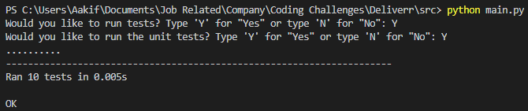
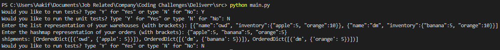

# Deliverr Coding Challenge
This repository contains my solution to Deliverr's coding challenge, Inventory Allocator.


## Requirements
This code was written in Python3. Note that if you try running the code in Python2, you may 
see some failed unit tests or some unhandled behavior from custom tests.


## How to Run
In order to run the code, navigate to the src directory, and run the main.py file. If you have
python as an environment variable on your console, you can type ```python main.py``` to start 
the program.  
I coded a basic interface so the user had choices: either run the unit tests or run some custom
test cases. Please note that the custom test cases do not take in an expected result; this is due
to some constraints regarding the lexicographical order of the returned shipment. The below images
show the potential ways of utilizing the program.

  



## Design Decisions
As stated above, there were some constraints that complicated the design of the shipment processing function.
For one, from the challenge description, outputs appeared to be lexicograpbically sorted. Unfortunately, basic
hash map implementations (like python's ```dict()```) lack order; to get around this, I used ```OrderedDict()```, 
which is an implementation of both a linked list and a hashmap. This meant that there would be no easy way to parse 
an expected value option.  
Now, focusing on the actual driver functions ```process_catalog()``` and ```get_shipment()```, I delve a  bit deeper into their 
implementations below.  

* Regarding ```process_catalog()```, the time complexity of the function is O(N * M) and the space complexity is also O(N * M).
N denotes the number of warehouses and M denotes the number of items in each warehouse. The time complexity is the product of 
the two because we need to iterate over all the warehouses and their items to get an accurate count of the total inventory across
the warehouses. The space complexity is also O(N * M) because of the case where all items across warehouses are unique.

* Regarding ```get_shipment()```, the time complexity of the function is O(M * NlogN), and the space complexity is O(N * M). Again,
like the previous function, N denotes the number of warehouses and M denotes the number of items in each warehouse. The time complexity
now includes N log N because we sort the warehouses for each order. Python's inbuilt sort method uses an adaptive implementation of merge 
sort called tim sort, which has a worst case time complexity of O(NlogN). So the total time complexity is actually O(M * (NlogN + N + NlogN)), 
which amortizes to O(M * NlogN). Again, similarly to the previous logic, if all items inside the warehouses are unique, and our orders query 
each unique item successfully, then we have a space complexity of O(N * M).


## Test Case Summary
1. This test case was listed at the beginning of the challenge description. Although there was no documented expected value, I decided to process 
this test case anyways.
2. This test case depicts the scenario when the queried amount of an order matches the exact amount currently stocked in the catalog.
3. This test case depicts the scenario when the queried amount of an order is greater than the amount currently stocked in the catalog.
4. This test case depicts the scenario when the queried amount of an order needs to be retrieved from multiple warehouses.
5. This test case depicts the scenario when the user provides an empty list of warehouses and an empty dictionary of orders.
6. This test case depicts the scenario when the user provides an empty list of warehouses.
7. This test case depicts the scenario when the user provides an empty dictionary of orders.
8. This test case depicts the scenario when the user provides orders with duplicate items of varying amounts.
9. This test case depicts the scenario when the user provides an order whose item is not currently stocked in the catalog.
10. This test case depicts the scenario when the user provides a large list of warehouses (and inventories) and an equally large dictionary of orders.


## Potential Improvements
The main improvement I would make would be to research better ways to either sort the warehouses (and thereby eliminate
the need for an ```OrderedDict()``` or find an inbuilt sort of a regular ```dict()```. The latter probably would involve 
defining my own OrderedDict to process the shipments. A much easier solution might be to just output a list of tuples rather 
than the current list of dictionaries (and this way, I could add the expected value option to the custom test logic).